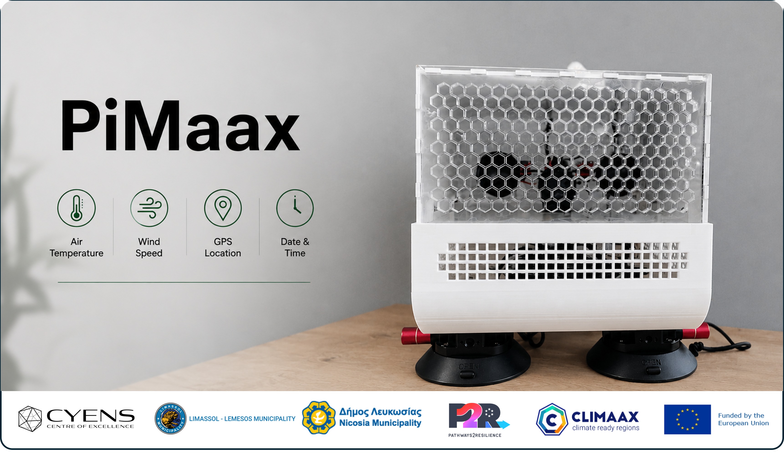
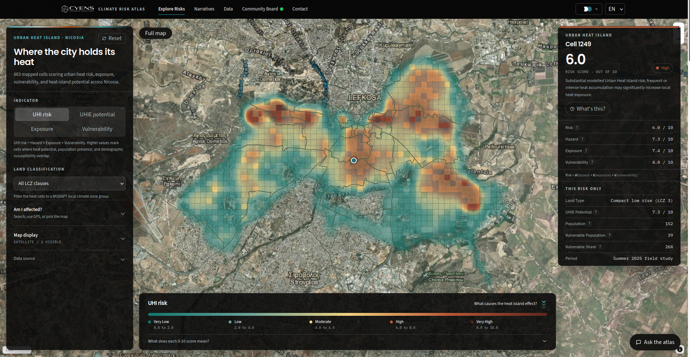

# PiMaax

<p align="center">
  
</p>

PiMaax is a Raspberry Pi based mobile environmental sensing system
developed for high resolution Urban Heat Island mapping and urban
climate monitoring.

The system combines temperature, wind speed, GPS, and time measurements
in a single platform. It is designed for mobile surveys to collect
georeferenced environmental measurements across urban areas.

PiMaax complements satellite, aerial, and geospatial observations with
in situ measurements at street and neighborhood scale.

## Project Context

PiMaax was developed in the context of two climate resilience projects
in Cyprus, with a focus on Urban Heat Island monitoring and fine scale
urban temperature mapping.

### Limassol P2R

The Limassol Pathways2Resilience project focuses on strengthening the
climate resilience of Limassol through improved climate risk assessment,
adaptation planning, and resilience actions. The project addresses
multiple climate risks, including extreme heat, Urban Heat Island
effects, flooding, drought, wildfires, and water scarcity.

Project website: [Limassol
P2R](https://superworld.cyens.org.cy/project26.html)

### CLIMAAX NIC

The CLIMAAX NIC project applies the CLIMAAX climate risk assessment
framework in the Municipality of Nicosia. The project focuses on
assessing flooding, Urban Heat Island effects, and heat related
vegetation damage to support local climate adaptation and risk
management planning.

Project website: [CLIMAAX
NIC](https://superworld.cyens.org.cy/project25.html)

## Measurements

PiMaax collects:

-   Air temperature from three TMP117 temperature sensors
-   Wind speed from an anemometer
-   GPS latitude and longitude
-   GPS altitude and speed
-   Date and time from the real time clock

## Hardware

The main components include:

-   Raspberry Pi
-   SparkFun Qwiic HAT
-   Three SparkFun TMP117 temperature sensors
-   DFRobot SEN0170 anemometer
-   SparkFun ADS1015 ADC
-   SparkFun RV-8803 real time clock
-   USB GPS receiver
-   PTN04050C boost converter

The complete component list is available in the [Bill of
Materials](pimaax-hardware/pimaax-billofmaterials.csv).

## Repository Structure

``` text
pimaax/
├── docs/
├── pimaax-firmware/
├── pimaax-hardware/
└── README.md
```

The repository is organized into three main parts.

### Documentation

The `docs` directory contains the complete setup instructions for
building and configuring PiMaax. The guides cover the Raspberry Pi
setup, temperature sensors, anemometer, real time clock, GPS, and
firmware setup.

[PiMaax Setup Guide](docs/README.md)


## Urban Heat Island Mapping

PiMaax measurements are used as part of a broader Urban Heat Island
mapping framework combining in situ observations, remote sensing,
geospatial information, and data driven modelling.

Related research:

Karatsiolis, S., Hadjinicolaou, P., Padubidri, C., and Kamilaris, A.\
"Decomposing Urban Heat Islands at Micro-Level: A Hybrid
Physics-Inspired and Data-Driven Modelling Framework."\
Available at SSRN 6805812.

PiMaax measurements contribute to Urban Heat Island mapping and climate risk analysis.
[Open the interactive CYENS Climate Risks Platform](https://climate-risks.cyens.org.cy/)

[](https://climate-risks.cyens.org.cy/)


<hr>

<table>
  <tr>
    <td align="center">
      
    </td>
    <td align="center">
      
    </td>
    <td align="center">
      
    </td>
    <td align="center">
      
    </td>
    <td align="center">
      
    </td>
    <td align="center">
      
    </td>
  </tr>
</table>
